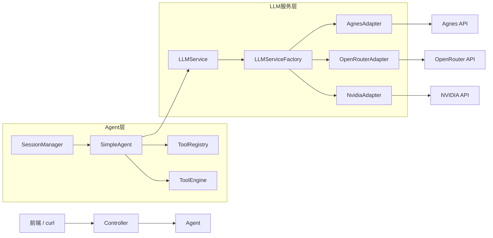

title: Agent项目记录-01
tags: [技术、项目、Record]
readTime: 15
time: 2026/06/13

# 从零手写 AI Agent：一个 Java 后端的 LLM Gateway 进化实录

> 这是我的 AI Agent 学习项目，从零用 Java 手写一套 LLM Gateway，逐步演进为具备 Tool Calling、Session 管理、流式输出的 Agent 核心框架。本文覆盖 Phase 0~2 的全部经验，包括架构设计、关键代码、8 个真实踩坑记录，以及 Phase 3 的 ReAct 规划。

---

## 一、为什么写这个问题

起因很简单：每次切 LLM Provider 都很痛。

Nvidia、OpenRouter、自部署模型……每个的接口格式略不同、认证方式不同、模型命名不同。写业务代码时脑子里得同时记三套 API 约定，切换成本高，还不可观测——调一次接口跑了哪个模型、花了多少 token、延迟多少，全靠 log 里盲猜。

于是立项：做一个 **LLM Gateway**，统一多 Provider 接入。

做着做着，目标变了。

某天看到 OpenAI 的 Function Calling 文档，突然理解了一个东西：LLM 不只是"问答机"，它能**自己决定调什么工具、传什么参数**。这才是 Agent 的核心——不是让 LLM 回答，而是让 LLM **行动**。

干脆学到底。 Gateway 继续做，但目标升级为 **从零手写 AI Agent 核心链路**。

**技术选型**：

| 选型 | 理由 |
|------|------|
| Java 21 + Spring Boot 4 | 主力语言，不用分心学新生态 |
| SQLite | 零配置，本地学习够用，不用 PostgreSQL |
| 不引入 LangChain4j | 学习目标就是手写，引入框架等于跳过最难的部分 |
| JDK 21 HttpClient | 原生支持 HTTP/2 + SSE，不需要 OkHttp |
| Thymeleaf 前端 | 减轻前端复杂度，聚焦后端 Agent 逻辑 |

**刻意不做的事**：单元测试、Docker 部署、分布式。学习阶段聚焦核心链路理解，这些以后再加。

---

## 二、架构总览

三阶段演进后，最终分层：



**关键接口**：

```java
// LLMService.java — 所有 Provider 的统一接口
public interface LLMService {
    ChatResponse chat(List<Message> messages, List<ToolDefinition> tools) throws Exception;
    SseEmitter stream(List<Message> messages);
    default ChatResponse chatStreaming(List<Message> messages, List<ToolDefinition> tools,
                                       Consumer<String> onContentDelta) throws Exception {
        throw new UnsupportedOperationException("流式 Tool Loop 未实现");
    }
}

// Agent.java — Agent 统一接口
public interface Agent {
    AgentResponse chat(AgentRequest request) throws Exception;
    void stream(AgentRequest request, Consumer<StreamEvent> emitter);
}
```

**Adapter 模式 + 工厂模式**是骨架：每个 Provider 实现 `LLMService` 接口，工厂根据 model 名前缀自动路由：

```java
// LLMServiceFactory.java — 自动注入所有 LLMService 实现，按 provider 名路由
public LLMServiceFactory(List<LLMService> services) {
    this.providerMap = services.stream()
            .filter(s -> s instanceof BaseLLMAdapter)
            .map(s -> (BaseLLMAdapter) s)
            .collect(Collectors.toMap(
                    BaseLLMAdapter::getProviderName,
                    Function.identity(),
                    (existing, duplicate) -> existing
            ));
}

public LLMService getLlmService(String modelName) {
    String provider = modelConfig.getProviderByModel(modelName.toLowerCase());
    LLMService service = providerMap.get(provider);
    if (service == null) throw new IllegalArgumentException("Unsupported provider: " + provider);
    if (service instanceof BaseLLMAdapter adapter) {
        adapter.setCurrentModel(modelName);  // 动态注入模型名
    }
    return service;
}
```

演进路径：**无状态网关（Phase 0）→ 有工具调用能力的 Agent（Phase 1）→ 有记忆、有会话隔离的 Agent（Phase 2）**。

---

## 三、Phase 0：清理遗留

接手项目时，代码能跑但有 6 个 P0 bug。不修干净，后面全是在错误基础上叠 bug。

### Bug 1：模型路由失效

现象：请求 `nv/llama-3.1-8b` 时走了 OpenRouter 而不是 Nvidia。

根因：`ChatController` 里写死了 `if (model.startsWith("nv"))` 字符串前缀匹配，但 Nvidia 实际传的是 `nv/` 格式，匹配逻辑有偏差。

修法：抽 `ModelConfig`，统一维护 `model → provider` 映射，所有路由走配置，Controller 不写业务逻辑。

### Bug 2：JSON 解析 NPE

现象：LLM 返回空 content 时，`response.path("choices").path(0).path("message").path("content").asString()` 没有空保护，直接炸。

修法：所有链式 `.path()` 调用加空判断，或用带默认值的 `.asString("")` 。

### Bug 3：线程泄漏

现象：EvalRunner 创建了 `ExecutorService` 但从不 shutdown，多次运行后线程爆满。

修法：加上 `@PreDestroy` 钩子，JVM 关闭前 `executor.shutdown()`。

### Bug 4：Jackson milestone 版本

现象：用了 `2.18.0-M01` milestone 版，某些 `@JsonInclude` 注解行为异常。

修法：回退到稳定版 `2.17.2`。

**教训**：Adapter 绝对不能硬编码 model 名，应该在调用时动态传入。配置和代码分开。

---

## 四、Phase 1：Tool Calling

### 4.1 Tool Calling 的本质

LLM 本身不会执行代码。它只会**告诉你它想调什么工具、传什么参数**。这个"告诉"就是 `tool_calls`：

```json
{
  "role": "assistant",
  "tool_calls": [{
    "id": "call_abc123",
    "type": "function",
    "function": {
      "name": "calculator",
      "arguments": "{\"expression\": \"2+3*4\"}"
    }
  }]
}
```

协议流程：**你的消息 → LLM → tool_calls → 你执行工具 → tool_result → LLM → 最终回复**。

"执行工具"这一步在服务端完成——这就是 Agent 的核心 Loop。

### 4.2 Tool 接口设计

最小化接口，四个方法：

```java
public interface Tool {
    String getName();          // 唯一标识，如 "calculator"
    String getDescription();   // LLM 靠这个决定要不要调，描述要清晰
    JsonNode getParameters();  // JSON Schema，约束 LLM 传的参数格式
    String execute(JsonNode arguments);  // 执行，返回文本结果
}
```

`getParameters()` 返回标准 JSON Schema：

```json
{
  "type": "object",
  "properties": {
    "expression": {"type": "string", "description": "数学表达式，如 2+3*4"}
  },
  "required": ["expression"]
}
```

### 4.3 ToolRegistry 自动扫描

不想手动注册每个工具。用 `@ToolDef` 注解 + `ApplicationContext` 扫描，Spring 容器启动时自动发现：

```java
@Component
public class ToolRegistry {
    private final Map<String, Tool> tools = new ConcurrentHashMap<>();

    @PostConstruct
    public void init() {
        Map<String, Object> beans = applicationContext.getBeansWithAnnotation(ToolDef.class);
        for (Object bean : beans.values()) {
            if (bean instanceof Tool tool) {
                tools.put(tool.getName(), tool);
            }
        }
    }

    public Tool getTool(String name) { return tools.get(name); }
    public List<Tool> getAllTools() { return List.copyOf(tools.values()); }
}
```

每个 Tool 类只需加 `@ToolDef` + `@Component`，零配置自动注册。

### 4.4 ToolEngine 解析执行

接收 LLM 返回的 `tool_calls` 数组，逐个解析、执行、收集结果：

```java
public List<ToolResult> execute(JsonNode toolCalls) {
    List<ToolResult> results = new ArrayList<>();
    for (JsonNode tc : toolCalls) {
        String callId = tc.path("id").asString("");
        String name = tc.path("function").path("name").asString("");
        String argStr = tc.path("function").path("arguments").isNull() ?
                "{}" : tc.path("function").path("arguments").toString();
        try {
            Tool tool = toolRegistry.getTool(name);
            JsonNode args = om.readTree(argStr);
            String result = tool.execute(args);
            results.add(new ToolResult(callId, name, result));
        } catch (Exception e) {
            results.add(new ToolResult(callId, name, "执行出错: " + e.getMessage()));
        }
    }
    return results;
}
```

注意：工具执行失败不抛异常，而是把错误信息作为 tool_result 塞回给 LLM。LLM 自己会处理"工具调用失败"的情况，比直接中断 Loop 更鲁棒。

### 4.5 Tool Loop：Agent 的心脏

```java
int maxToolCalls = 10;
int callCount = 0;
while (callCount < maxToolCalls) {
    ChatResponse response = service.chat(history, tools);
    if (!response.hasToolCalls()) break;  // 没有工具调用，退出 Loop

    sessionManager.append(sessionId, /* assistant message with tool_calls */);

    List<ToolResult> results = toolEngine.execute(response.getToolCalls());
    for (ToolResult r : results) {
        sessionManager.append(sessionId, /* tool message with result */);
    }
    callCount++;
}
```

终止条件有两个：LLM 不再要求工具调用（正常结束），或达到最大调用次数（防死循环，生产环境必须加）。

### 4.6 5 个内置工具

| 工具名 | 功能 |
|--------|------|
| `calculator` | 数学表达式求值 |
| `datetime` | 当前时间/日期查询 |
| `web_search` | 网络搜索（调用搜索 API） |
| `web_fetch` | 抓取网页内容 |
| `file_io` | 本地文件读写 |

---

## 五、Phase 2：Agent 核心能力

Phase 1 有个大问题：Tool Loop 写在 `ChatController` 里，和 HTTP 强耦合。

```java
// Phase 1 的反模式 — 控制器里全是业务逻辑
@PostMapping("/chat")
public ResponseEntity<?> chat(@RequestBody ChatRequest request) {
    // 直接在这里跑 Tool Loop... 代码几百行
}
```

问题：无法复用（其他入口想调 Agent 就得 copy 代码）、无法测试（绑着 HTTP）、Controller 职责过重。

### 5.1 Agent 接口：抽出来，变成纯 Spring Bean

```java
public interface Agent {
    AgentResponse chat(AgentRequest request) throws Exception;
    void stream(AgentRequest request, Consumer<StreamEvent> emitter);
}
```

两个方法：
- `chat()`：同步调用，跑完 Tool Loop 一次返回最终结果
- `stream()`：流式调用，通过 `Consumer<StreamEvent>` 回调推送每个事件

`SimpleAgent` 是纯 Spring Bean，不依赖 HTTP，任何 Service 都可以 `@Resource` 注入调用。

### 5.2 StreamEvent：流式通信的 POJO

```java
public class StreamEvent {
    public enum Type { CONTENT, TOOL_CAL, TOOL_RESULT, DONE, ERROR }

    private Type type;
    private String data;        // JSON，下游按 type 反序列化
    private String rawContent;  // 仅 CONTENT 用，直接追加文本

    public static StreamEvent content(String delta) { /* ... */ }
    public static StreamEvent toolCall(String toolCallJson) { /* ... */ }
    public static StreamEvent toolResult(String resultJson) { /* ... */ }
    public static StreamEvent done() { /* ... */ }
    public static StreamEvent error(String error) { /* ... */ }
}
```

五种事件类型，前端根据 type 做不同 UI 处理。

### 5.3 Session 管理：双层架构

Agent 需要"记忆"——不是 LLM 的记忆，是应用层的会话管理。

```java
public class SessionManager {
    // 内存缓存：O(1) 读取
    private final Map<String, List<Message>> cache = new ConcurrentHashMap<>();
    private final MessageStore messageStore;  // SQLite 持久化
}
```

**读路径**：先查内存缓存 → 未命中则从 SQLite 加载 → 放入缓存返回。

**写路径**：同时写内存 + SQLite（WAL 模式，读写不互斥）。

双重检查锁保证同一个 sessionId 只从 SQLite 加载一次：

```java
public List<Message> getOrCreate(String sessionId) {
    List<Message> cached = cache.get(sessionId);
    if (cached != null) return cached;
    synchronized (cache) {
        cached = cache.get(sessionId);
        if (cached != null) return cached;
        List<Message> loaded = new ArrayList<>(messageStore.load(sessionId));
        List<Message> existing = cache.putIfAbsent(sessionId, loaded);
        return existing != null ? existing : loaded;
    }
}
```

### 5.4 流式 Tool Loop：最复杂的代码

`chatStreaming()` 方法（237行处）是整个项目最复杂的部分。核心挑战：LLM 的 SSE 流式响应里，`tool_calls` 的 `arguments` 是**分片推送**的，而不是一次性给完整的。

```
data: {"choices":[{"delta":{"tool_calls":[{"index":0,"id":"call_abc","function":{"name":"calculator"}}}]}}]}
data: {"choices":[{"delta":{"tool_calls":[{"index":0,"function":{"arguments":"{\"exp"}}]}}]}
data: {"choices":[{"delta":{"tool_calls":[{"index":0,"function":{"arguments":"ression\""}}]}}]}
data: {"choices":[{"delta":{"tool_calls":[{"index":0,"function":{"arguments":\": \"2+3\""}}]}}]}
data: {"choices":[{"delta":{"tool_calls":[{"index":0,"function":{"arguments":"}"}}]}}]}
data: [DONE]
```

同一个 `index` 对应的 `arguments` 需要拼接，不能用最后一个 chunk：

```java
// 核心数据结构
Map<Integer, StringBuilder> toolCallArgs = new HashMap<>();
Map<Integer, String> toolCallIds = new HashMap<>();
Map<Integer, String> toolCallNames = new HashMap<>();

// 逐行处理 SSE
while ((line = br.readLine()) != null) {
    String data = line.substring(6);   // 去掉 "data: " 前缀
    if ("[DONE]".equals(data)) break;

    JsonNode delta = om.readTree(data).path("choices").path(0).path("delta");

    // 推 content delta 给前端
    if (delta.has("content")) {
        String content = delta.path("content").asString();
        if (!content.isEmpty()) {
            fullContent.append(content);
            onContentDelta.accept(content);  // 实时推给前端打字机效果
        }
    }

    // 拼接 tool_calls
    if (delta.has("tool_calls")) {
        for (JsonNode tc : delta.path("tool_calls")) {
            int index = tc.path("index").asInt();
            if (tc.has("id"))   toolCallIds.put(index, tc.path("id").asString());
            if (tc.has("function") && tc.path("function").has("name"))
                toolCallNames.put(index, tc.path("function").path("name").asString());
            if (tc.has("function") && tc.path("function").has("arguments"))
                toolCallArgs.computeIfAbsent(index, k -> new StringBuilder())
                           .append(tc.path("function").path("arguments").toString());
        }
    }
}

// [DONE] 后，把拼接好的 arguments 组装成完整 JSON
for (int i = 0; i < toolCallIds.size(); i++) {
    String args = toolCallArgs.getOrDefault(i, new StringBuilder()).toString();
    // 拼接 id + name + 完整的 arguments
}
```

**token 估算**：流式响应没有 `usage` 字段，要用字符数估算：`TokenCounter.estimateTokens(text)`，规则大概 1 token ≈ 4 个英文字符或 1.5 个中文字符。

### 5.5 前端 SSE 流式展示

```javascript
const evtSource = new EventSource(`/api/agent/stream?message=${msg}&model=${model}&sessionId=${sessionId}`);

evtSource.onmessage = (event) => {
    const data = JSON.parse(event.data);
    switch (data.type) {
        case 'content':
            appendText(data.rawContent);  // 打字机效果，逐字追加
            break;
        case 'tool_call':
            showToolCard(JSON.parse(data.data));  // 弹出工具调用卡片
            break;
        case 'tool_result':
            updateToolResult(JSON.parse(data.data));  // 更新工具结果
            break;
        case 'done':
            finalize();
            evtSource.close();
            break;
        case 'error':
            showError(data.data);
            evtSource.close();
            break;
    }
};
```

sessionId 存 localStorage，刷新页面不丢对话。

### 5.6 SimpleAgent.chat() 完整解析

```java
public AgentResponse chat(AgentRequest request) throws Exception {
    // 1. 确保 sessionId
    if (request.getSessionId() == null || request.getSessionId().isBlank())
        request.setSessionId(sessionManager.newSessionId());
    String sessionId = request.getSessionId();

    // 2. 追加用户消息
    sessionManager.append(sessionId, new Message("user", request.getMessage(), null, null, null));

    // 3. 构建工具定义列表（LLM 靠这个知道有哪些工具可用）
    List<ToolDefinition> tools = toolRegistry.getAllTools().stream()
            .map(t -> new ToolDefinition("function",
                    new ToolDefinition.FunctionDef(t.getName(), t.getDescription(), t.getParameters())))
            .toList();

    // 4. Tool Loop
    int maxToolCalls = 10, callCount = 0;
    ChatResponse lastResponse = null;
    List<ToolCallRecord> toolHistory = new ArrayList<>();

    while (callCount < maxToolCalls) {
        List<Message> history = sessionManager.getHistory(sessionId);  // 自动裁剪上下文
        lastResponse = llmServiceFactory.getLlmService(request.getModel()).chat(history, tools);
        if (!lastResponse.hasToolCalls()) break;

        // 记录 assistant tool_calls 消息
        sessionManager.append(sessionId, new Message("assistant",
                lastResponse.getContent(), lastResponse.getToolCalls(), null, null));

        // 执行工具，追加 tool_result 消息
        List<ToolResult> results = toolEngine.execute(lastResponse.getToolCalls());
        for (ToolResult r : results) {
            sessionManager.append(sessionId, new Message("tool",
                    r.getContent(), null, r.getToolCallId(), r.getToolName()));
            toolHistory.add(new ToolCallRecord(/* ... */));
        }
        callCount++;
    }

    // 5. 追加最终 assistant 消息
    String finalContent = lastResponse != null && lastResponse.getContent() != null
            ? lastResponse.getContent() : "已达最大工具调用次数";
    sessionManager.append(sessionId, new Message("assistant", finalContent, null, null, null));

    return AgentResponse.builder()
            .content(finalContent).sessionId(sessionId)
            .toolHistory(toolHistory)
            .inputTokens(lastResponse.getInputTokens())
            .outputTokens(lastResponse.getOutputTokens())
            .build();
}
```

这就是整个 Agent 的完整生命周期：接收 → 记忆 → 调 LLM → 拦截工具调用 → 执行 → 喂回 LLM → 循环 → 输出。

---

## 六、踩坑清单

### 坑 1：computeIfAbsent 并发陷阱

**现象**：高并发下 Session 偶尔丢消息。

**根因**：`ConcurrentHashMap.computeIfAbsent()` 的 lambda 在 Java 8 里不保证原子执行。两个线程同时 `computeIfAbsent(sessionId, ...)` 时，可能一个刚 put 进去，另一个还没完成初始化，导致消息写入后立刻被覆盖。

**解法**：改用 DCL（Double-Check Locking）+ `synchronized` 块 + `putIfAbsent`，见 SessionManager 的 `getOrCreate`。

### 坑 2：流式 tool_calls.arguments 分片拼接

**现象**：工具执行时 arguments 总是 `null` 或不完整。

**根因**：以为 SSE 的 tool_calls 每个 chunk 都是完整 JSON，实际上 `arguments` 是逐块推送的。第一个 chunk 只有 `id` 和 `name`，后面的才拼 `arguments`。

**解法**：用三个 `Map<Integer, ...>` 分别追踪 id、name、arguments（StringBuilder 拼接），等 `[DONE]` 后组装。

### 坑 3：SSE 5 分钟超时

**现象**：长的 Tool Loop 在浏览器里莫名断开。

**根因**：Tomcat 默认 SSE 超时 5 分钟，Loop 跑多个工具时可能超限。

**解法**：降低 `SseEmitter` 超时时间，同时前端设置定期 ping（Spring 定时 `emitter.send(SseEmitter.event().comment("ping"))`）保持连接活跃。

### 坑 4：FileIOTool JSON Schema 类型 typo

**现象**：LLM 传文件路径时总是格式错误。

**根因**：`getParameters()` 里 `"path"` 字段的 type 写成了 `"integer"`，应该是 `"string"`。LLM 按照 integer 约束生成了数字而非路径字符串。

**解法**：修正 type 为 `"string"`。教训：JSON Schema 是 LLM 和工具之间的契约，一个字都错不得。

### 坑 5：Adapter 默认模型不一致

**现象**：没传 model 时，有时走 `meta/llama-3.1-8b`，有时走 `google/gemini-2.0-flash`。

**根因**：每个 Adapter 里 `defaultModel` 硬编码不同，工厂返回后没有统一处理默认值。

**解法**：在 `ModelConfig` 里统一维护 `provider → defaultModel`，工厂注入前查配置。

### 坑 6：同步 chat 没有流式反馈

**现象**：调同步 `/api/agent/chat` 接口，等 30 秒什么输出都没有，体验很差。

**根因**：`chat()` 强制等整个 Tool Loop 跑完才返回，中间过程用户看不到。

**解法**：这是已知局限，前后端都推荐用流式接口。同步接口只用于简单的非流式后端调用。

### 坑 7：Message POJO 的 toolCalls 字段类型

**现象**：序列化消息历史时 toolCalls 经常丢失。

**根因**：`Message.toolCalls` 用 `List<ToolCall>` 强类型，但不同 LLM Provider 返回的 tool_calls 结构略有差异，反序列化失败。

**解法**：改用 `JsonNode` 存储，不做强类型绑定，用到时再解析。灵活性 > 类型安全。

### 坑 8：会话 ID 碰撞概率

**现象**：理论上 UUID 截断后可能有碰撞。

**根因**：`newSessionId()` 截取 UUID 前 16 位（64 bit），虽然碰撞概率极低（2 的 64 分之一），但不是零。

**解法**：当前规模够用。生产环境改成完整 UUID 或雪花 ID。

---

## 七、Phase 3 预告：ReAct

当前 Agent 的局限：**被动响应**。用户发消息 → Agent 处理 → 输出。没有主动思考、没有规划、没有自我纠错。

ReAct（Reason + Act）是把 LLM 变成真正的"自主 Agent"：

```
IDLE → THINKING → ACTING → OBSERVING → THINKING → ... → DONE
```

它会把"思考过程"也输出出来：

```
Thought: 我需要先查当前时间，再判断是否是工作时间
Action: datetime
Observation: 2026-06-13 14:32, 星期六
Thought: 现在是周末下午，提醒用户休息
Output: 周末下午了，歇歇吧～
```

Phase 3 的四个核心组件：

1. **状态机**：管理 IDLE / THINKING / ACTING / WAITING 状态流转
2. **ContextManager**：智能裁剪对话历史（不重要的细节摘要压缩，保留关键信息）
3. **Multi-Agent**：多个 Agent 协作，有"指挥 Agent"分配任务给"执行 Agent"
4. **Plan 机制**：大任务先拆步骤，再执行，不是一头扎进去

---

## 八、如何本地运行

### 环境变量

```bash
export NVIDIA_API_KEY=sk-xxx
export OPENROUTER_API_KEY=sk-xxx
export AGNES_API_KEY=sk-xxx
```

### 启动

```bash
mvn spring-boot:run
```

默认端口 `8080`。

### 测试流式对话

浏览器打开 `http://8080/agent`，或直接 curl：

```bash
# 同步调用
curl -X POST http://localhost:8080/api/agent/chat \
  -H "Content-Type: application/json" \
  -d '{"message": "现在几点了？", "model": "nv/llama-3.1-8b"}'

# 流式调用
curl -N http://localhost:8080/api/agent/stream \
  -G --data-urlencode "message=帮我搜索今天新闻" \
  --data-urlencode "model=openrouter/anthropic/claude-sonnet-4"
```

---

## 结语

从多 Provider 网关到有记忆、有工具调用、有流式输出的 Agent，三个阶段下来，最大的感悟是：

**Agent 的核心不是调用 LLM，而是设计 LLM 和工具之间的契约。**

Tool 怎么注册、工具调用怎么拦截、结果怎么喂回 LLM、对话历史怎么裁剪、流式 delta 怎么拼接——这些东西框架帮你藏起来了，但只有亲手写过才知道为什么这么设计。

代码在 GitHub：[llm-gateway](https://github.com/)（项目仓库）

Phase 3 继续。
