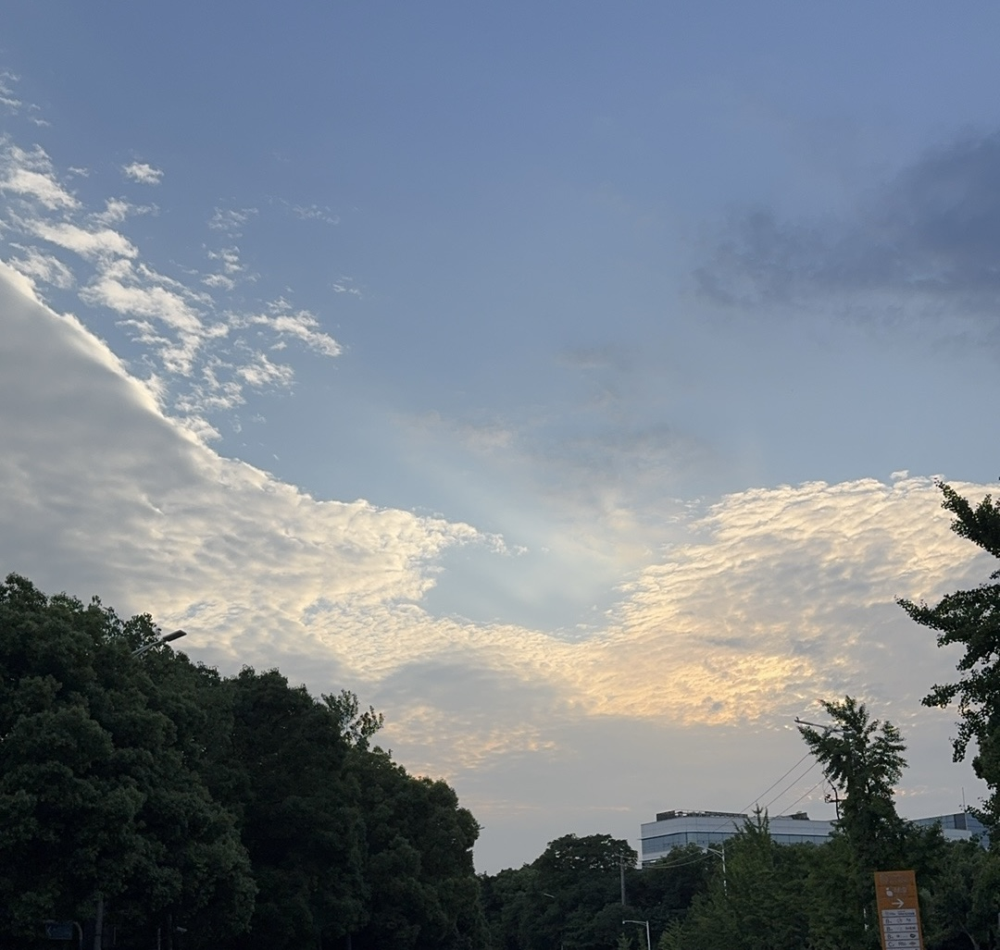

title: 命与运
tags: [随笔、碎碎念]
readTime: 3
time: 2026/06/06

# 命与运

> 2026/06/06 Saturday \
> 《遗憾最小化》 \
> \
> It's 7AM and I'm on a mountain with a view \
> I'm the only one alone at a table meant for two

### 我的青春也不是没伤痕

“冷的天色，你是否多穿一件呢？”
窗外的风裹杂着一丝不属于夏天的凉意透过纱窗的缝隙轻轻拂过，凌晨中的夜色夹杂着点点微光，不知有多少辗转难眠的又陷入了回忆。屏幕的光映在脸上，一份改了又改的简历，一条又一条被拒绝的通知，一个在收藏夹已经吃灰的教程，还有朋友圈的朋友们有意义的生活，无时无刻都在告诉我，我好像也是那么的普通平庸。手指悬在键盘上，却迟迟敲不下去。好像全世界都在奔跑，只有我站在十字路口，手里攥着一把地图，却分不清哪一张是真的。
这就是奥德赛时期吧。船已经离了港，故乡的灯塔越来越小，而伊萨卡还远在天边。海面上没有路标，只有风。

### 命运

我常常想，人这一生，到底有多少是"命"，有多少是"运"。
命是那些你无法选择的东西，是老天爷直接给予你的最原本的东西。你生在什么样的家庭，拥有什么样的性格，在什么样的时代里长出第一根骨头。它是你醒来时窗外的天色，是血液里流淌的某种倔强或温柔，是你第一次心动时心跳的频率。命是底色，像一块布的经纬，决定了你以什么样的质地去承接后面的颜色。你不能换掉这块布，但你可以决定在上面绣什么。运是那些流变不居的际遇。是在图书馆偶然坐到的邻桌，是某次犹豫之后还是点下的发送键，是暴雨天躲进的那家书店，是深夜里回复的那条消息。运不是彩票，不是某天早上醒来突然砸中的大奖。运是你走在某条路上时，迎面吹来的那阵风。它青睐的不是最聪明的人，而是那些在风里仍然愿意把帆张开的人。

命给你边界，运给你缝隙。而遗憾最小化，是教我们在边界与缝隙之间，诚实地问自己：如果到了八十岁，我会不会为今天没有迈出这一步而后悔？奥德赛时期的痛苦，往往不是因为没有选择，而是因为选择太多。我们被"可能性"这个词宠坏了。社交媒体把一百种人生同时推到你面前，每一条都光鲜亮丽，每一条都好像在说：你也可以。于是我贪婪地收藏，焦虑地比较，在无数个"如果"里把自己撕成碎片。

对的没关系，错的也没关系。奥德赛漂泊了十年，绕了远路，被风神戏弄，被女巫蛊惑，在卡律布狄斯和斯库拉之间九死一生。可那些弯路没有白走。它们让他终于认出了自己是谁，也让他终于有资格回到伊萨卡。我要慢慢接受自己，我拥有这副身体，我拥有这个思想，我的存在就是如此。我承认我的普通，我承认我的平庸，但是在命运既定下的这条两端钉死的线之间，我也想拨动一下这根弦，即使不痛不痒。

---

愿我们八十岁时，坐在长椅上挽着彼此的手，笑着说起没选的路，然后庆幸自己选了这条，我不曾后悔！
