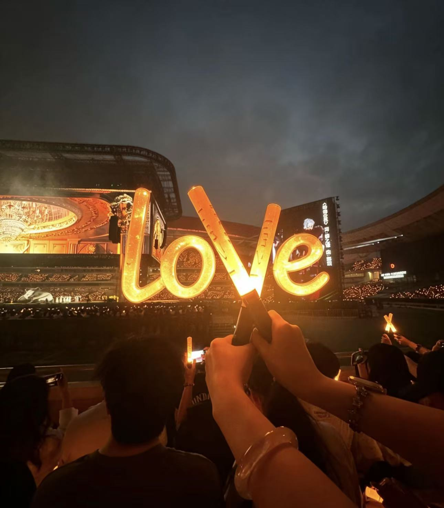
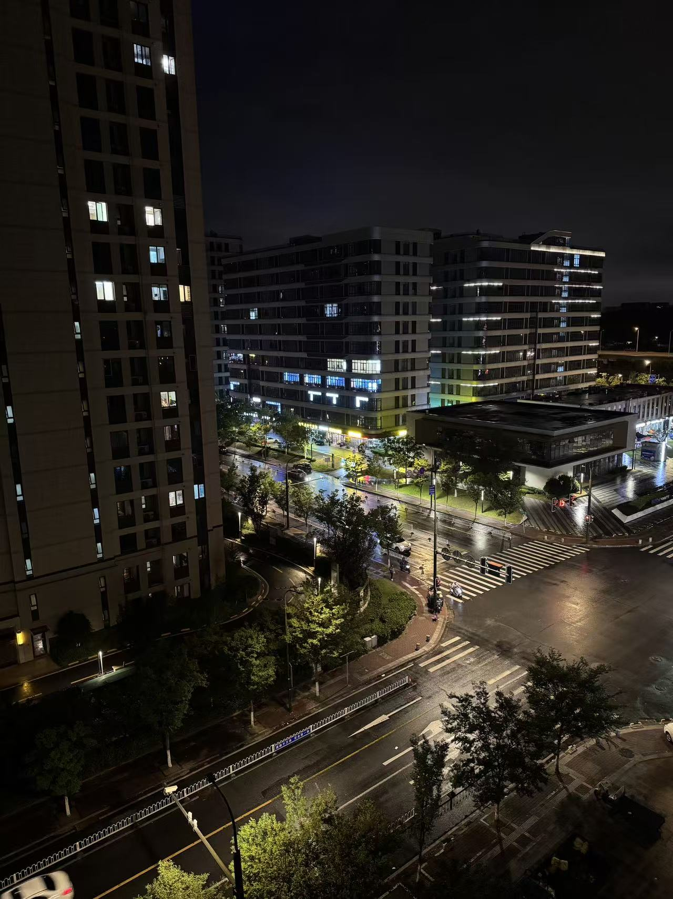

title: The room belonging to me \
tags: [随笔、碎碎念] \
readTime: 3 \
time: 2026/06/09

# The room belonging to me
> 2026/06/09 Tuesday
> "一个人就是一片领土。"

电梯门略显迟钝的合上，我习惯性的打开手机，百无聊赖，电梯开始缓缓运行，上行到对应的楼层，总是会有一个下坠的感觉，不知是电梯的设定还是人的惯性。

手指触摸着智能门锁对应的数字，隔着一层薄薄的保护膜一次次的按下。有时我手速很快总是输错，我知道只要输过的密码中包含正确密码就能开门，错了可以重新再输。我总是习惯性地顿一顿。金属咬合的声音很轻，但在空荡的楼道里，像某种宣言。这是我第一次拥有一间只属于自己的屋子，尽管是月租的。门开了，是一间三室的，在九楼，一梯一户，规格很高了，当然租金也不便宜。朝南的窗户外是一条街水马龙的街道和对面小区同样高耸楼房。到了晚上夜色渐亮就能看清街对面楼很美的夜景和街道灯光，尤其是下雨的时候。

在此之前，我从未真正拥有过一个"房间"。宿舍是集体主义的温床，六个人共用一套呼吸节律，一个人的翻身是四个人的涟漪。其实我从未真正独处过，也从未真正被看见过。而家的房间是母亲收拾的，书桌靠着的墙上还摆着你从小到大的奖状。

这个房间不一样。它是我用每一个月的工资押一付一换来的。尽管房间很小，小到一张床、一张电竞桌、一把椅子之后，就只剩下一个狭窄的拐角。但奇怪的是，越小的地方，越让人有一种奇异的郑重感。我开始在意一些从前从未在意过的事：窗帘的遮光度、枕头的凹陷形状、饮水机沸腾时的分贝、窗外时常摩托大声炸街的吵闹。这些琐碎的物理参数，突然构成了我生活的经纬。

几乎每一个周末，我都没有出门。不是不想，而是不知道出门之后该去哪里。城市很大，但没有一条街道是为我而存在的，离家很远，很远，其实一直有一种疏离感，没有家那种安心的感觉。于是我坐在地板上——数着从窗帘缝隙里漏进来的光斑。我习惯关上阳台门，关上房门，全黑的房间里面点一盏屏幕护眼灯，然后打开电脑播放音乐或者是一个直播，然后躺在床上借着这点灯光玩一会手机。时常觉得热了就爬起来开空调，然而还没吹够两分钟就会觉得冷，盖上被子也无济于事，于是无奈又爬起来关掉。就这么来来回回的就又到了夜里一点。

夜里，城市的声音从窗缝里渗进来。高架上的车流是低频的轰鸣，偶尔有救护车的鸣笛刺破它，像一根银针穿过棉布。隔壁的夫妻在吵架，声音压得很低，但情绪的波动穿透了薄薄的隔断墙。楼上有小孩在哭，哭声断断续续，最后归于沉寂。我躺在黑暗中，希望能早点入睡，又在睡前不断懊悔——今天怎么又熬夜了。然而第二天依旧如此。

我的明天又在何方呢...

---

「行船入夜，恰江上升明月。圆如玉坠，仿若身在故乡，似与你并肩共赏。」
-电影《给阿嬷的情书》-

