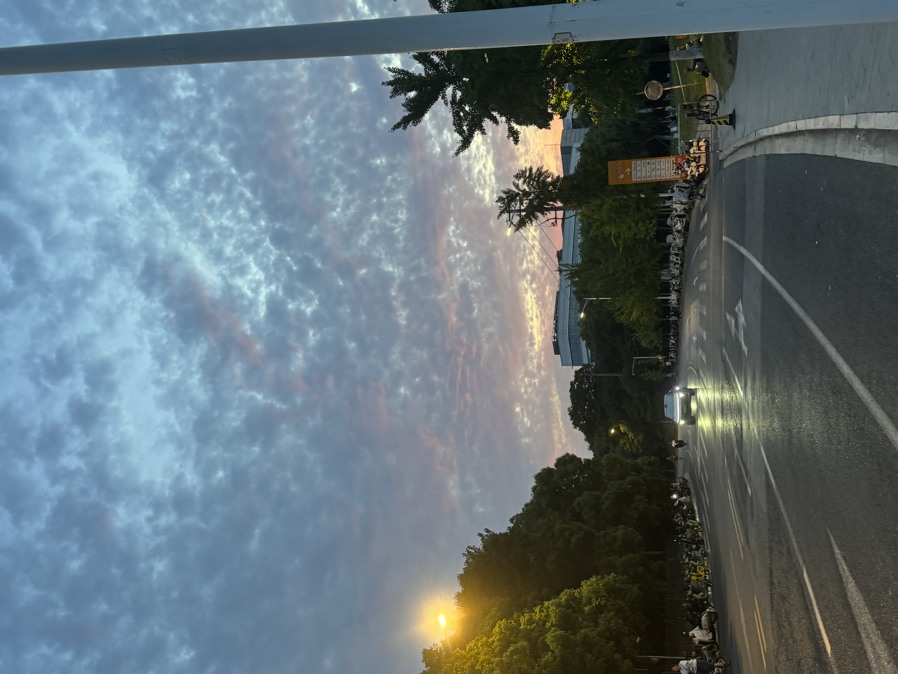

title: 踏出那一步
tags: [随笔、碎碎念]
readTime: 3
time： 2026/06/11

# 踏出那一步

> 2026/06/11 Thursday \
> "趁我还年轻， 我不后悔我的任何一个决定，每一条路都是我应该经历，无论痛苦或开心！"



## 十字路口

我离职了！
嗯，离职了。不是一时的冲动，也不是值得我焦虑、迷茫的大事。这是一种站在命运交叉路口的感觉，是的，就是这种感觉，又一次袭来了。

它的第一次出现，是在2021年的夏天，高考完填报志愿的时候。联想到中考填报志愿好像也没出现这种感觉，因为当时中考的目标只有一个，也只能是那个。
第二次是2022年大一结束马上进入大二的时候，经过一年机械类专业的学习，我觉得我对这些知识完全不感兴趣，于是，我在命运的十字路口转了一圈又一圈，选择勇敢的踏出了那一步 --- 转专业。转到大数据专业，在现在 计算机专业 没落的现状下，回头看当时的选择不一定是正确的，但是我不会后悔，至少我确认我确实是对这些感兴趣的，我有动力，我愿意去研究新东西，也向往极客的风格，那种是自己做出来东西的成就感、满足感简直溢于言表。

现在2026年的夏天，它又一次袭来了，我觉得这次没有之前那么匆忙，甚至它一直在我的心头摆动，趁着春天细雨的滋润也悄悄的发了芽，在夏天成功破了土，成为我一个前进路上的“绊脚石”。因为直至今日为止，我其实还是没有勇气能去很坦然的去面对它，这个课题不止对我来说一个难解决的问题，对我这个年纪的同龄人都是一个困扰大家很久的难题。

最近网上很多的说，这是我们的“奥德赛时期”。我们刚刚毕业，刚刚步入社会，接触了很多已经积累厚实资本的成年人和前辈，也被网络媒体的宣传给刺激的头晕脑胀。我们渴望成功，渴望将功立业，渴望去拿一个世俗意义的完美人生。可是一切都好像太急了，从一个大家眼里的小孩，变成渴望成为顶天立地的大人好像也不过一年的时间。

家里其实在这一年里出现了一些变故，本来家中的情况应该是无忧无虑，我无需担心的，但现在我多多少少也需要多加考虑了。这无疑也加重了我的忧愁和繁多思绪。。。

未完待续。。。


### 离职报告

```text
尊敬的领导：
    您好！经过慎重且全面的考虑，因个人职业发展方向调整，我在此向公司提出离职申请，计划于2026年6月30日正式离职，恳请领导予以批准。
    自入职以来，我有幸得到公司的培养与信任，也深受领导的悉心指导与同事们的热心帮助，这段工作经历让我收获良多，对此我心怀感激。在正式离职前，我会一如既往地履行岗位职责，全力配合完成各项工作交接，确保业务平稳过渡，尽量减少因我的离职给团队带来的影响。
    祝愿公司未来发展越来越好，也祝愿领导和同事们工作顺利。
                                                                工号：2507xxxx
                                                                申请人：xxx
                                                                电话：175xxxx6723
                                                                申请日期：2026年6月11日
```
